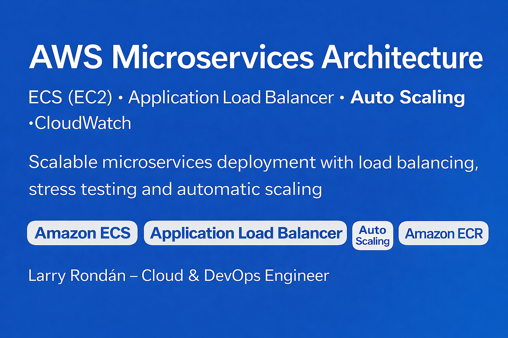

📘 Available languages:
- 🇪🇸 [Spanish Version](README.md)
- 🇬🇧 [English Version](README_EN.md)

# 🚀 AWS Microservices Architecture with ECS and Auto Scaling

This repository documents the **design, deployment, and validation of a microservices architecture on AWS**, applying real-world **Cloud and DevOps best practices** oriented to production environments.

The project demonstrates the use of **Amazon ECS (EC2 Launch Type)**, **Application Load Balancer**, **Auto Scaling**, **Amazon ECR**, **CloudWatch**, and **Route 53**, including **real load testing** to validate automatic scaling of both services and infrastructure.

---

## 🎯 Concept and Objective

I designed, implemented, and documented a **production-ready microservices architecture**, composed of multiple services (`web`, `cats`, `dogs`) deployed as Docker containers on **ECS running on EC2 instances**.

Project goals:

- Demonstrate **hands-on expertise in scalable cloud architectures**
- Validate **real auto scaling** (ECS tasks + EC2 instances)
- Implement **monitoring and alerting** with CloudWatch
- Provide **clear, visual, and professional documentation**

💡 *This project simulates a real production scenario beyond a basic lab setup.*

---

## 🧭 Architecture Diagram

📄 **View full image:**

Architecture flow:

1️⃣ Users access the domain `ecs.devopscloud.click`  
2️⃣ **Route 53** resolves DNS to the **Application Load Balancer**  
3️⃣ The **ALB** routes traffic by path to microservices (`web`, `cats`, `dogs`)  
4️⃣ **ECS** runs tasks on private **EC2 instances**  
5️⃣ **Auto Scaling** adjusts tasks and instances based on load  
6️⃣ **CloudWatch** monitors metrics and triggers alarms  

---

## 🧩 AWS Services Used

| AWS Service | Main Function |
|------------|---------------|
| **Amazon VPC** | Isolated network with public and private subnets (Multi-AZ). |
| **Amazon ECS (EC2)** | Docker container orchestration. |
| **Amazon ECR** | Private Docker image registry. |
| **Application Load Balancer** | Load balancing and path-based routing. |
| **Auto Scaling Group** | Automatic EC2 instance scaling. |
| **CloudWatch** | Metrics, logs, and scaling alarms. |
| **Amazon Route 53** | DNS and custom domain management. |

---

## 🪜 Step-by-Step (Visual and Documented)

> 📁 Evidence folder: `docs/screenshots/`  

---

### **1️⃣ VPC Creation using CloudFormation**
A custom VPC is deployed using **Infrastructure as Code**, ensuring reproducibility.

📸 **Evidence:**  

---

### **2️⃣ VPC Successfully Created**
📸 **Evidence:**  

---

### **3️⃣ VPC Architecture Diagram**
📸 **Evidence:**  

---

### **4️⃣ Amazon ECR Repository Creation**
Independent repositories are created for each microservice.

📸 **Evidence:**  

---

## 🔁 Repeated Process per Microservice

⚠️ **Steps 5, 6, and 7 are repeated identically for `web`, `cats`, and `dogs`.**  
Only the repository name and application content change.

---

### **5️⃣ Docker Image Build**
📸 **Example (cats):**  

---

### **6️⃣ Docker Image Tagging**
📸 **Example (cats):**  

---

### **7️⃣ Push Docker Image to Amazon ECR**
📸 **Example (cats):**  

---

### **8️⃣ Images Available in ECR**
📸 **Evidence:**  

---

### **9️⃣ ECS Cluster Creation**
📸 **Evidence:**  

---

### **🔟 ECS Task Definitions**
📸 **Evidence:**  

---

### **1️⃣1️⃣ Application Load Balancer Creation**
📸 **Evidence:**  

---

### **1️⃣2️⃣ ECS Services Deployment**
📸 **Evidence:**  

---

### **1️⃣3️⃣ Access via Load Balancer DNS**
📸 **Evidence:**  

---

### **1️⃣4️⃣ Microservices Access**
📸 **Evidence:**  
  

---

### **1️⃣5️⃣ Monitoring with CloudWatch**
📸 **Evidence:**  

---

### **1️⃣6️⃣ Route 53 Configuration**
📸 **Evidence:**  

---

### **1️⃣7️⃣ Access via Custom Domain**
📸 **Evidence:**  

---

## 📈 Auto Scaling and Load Testing

### **1️⃣8️⃣ Web Service Auto Scaling Configuration**
📸 **Evidence:**  

---

### **1️⃣9️⃣ Scaling Configuration Applied**
📸 **Evidence:**  

---

### **2️⃣0️⃣ Load Testing with Siege**
📸 **Evidence:**  

---

### **2️⃣1️⃣ CloudWatch Alarm Triggered**
📸 **Evidence:**  

---

### **2️⃣2️⃣ Automatic ECS Task Scaling**
📸 **Evidence:**  

---

### **2️⃣3️⃣ Auto Scaling Group Capacity Adjustment**
📸 **Evidence:**  

---

### **2️⃣4️⃣ EC2 Instance Auto Scaling**
📸 **Evidence:**  

---

## 🧠 Key Learnings

- Production-grade ECS architecture design
- Dual-level auto scaling (services + infrastructure)
- Correct use of ALB metrics for scaling
- Real load testing validation
- Observability as a DevOps pillar ✨

---

## 🧰 Skills Demonstrated

AWS · ECS · EC2 · Docker · ECR · ALB · Auto Scaling · CloudWatch · Route 53 · Load Testing · DevOps

---

## 🙋 Author

**Larry Andrés Rondán Manrique**  
☁️ *Cloud & DevOps Engineer*  

📬 Email: larrycloudaws@gmail.com  
🐙 GitHub: https://github.com/larrycloud  
🌍 Portfolio: https://devopscloud.click  

---

✨ *Project developed as a professional practice in scalable and automated cloud architectures on AWS.*
