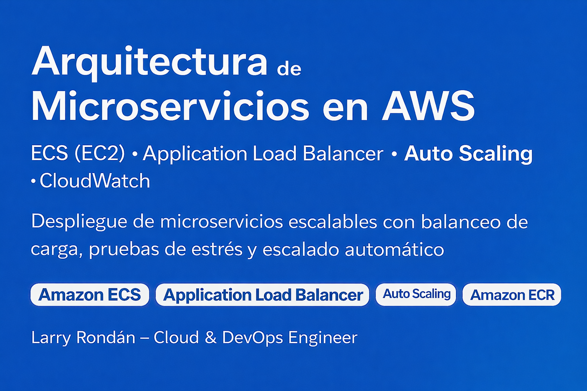

🟦 Arquitectura de Microservicios en AWS
Despliegue de microservicios utilizando ECS, ALB y ECR

---

Este proyecto presenta el diseño de una arquitectura de microservicios desplegada en AWS, utilizando:

- Amazon ECS (EC2 Launch Type)
- Application Load Balancer (ALB)
- Amazon ECR
- VPC personalizada con subredes públicas y privadas
- Monitoreo centralizado con CloudWatch

El objetivo es mostrar una arquitectura escalable, segura y apta para entornos de producción, como parte de mi portafolio Cloud & DevOps.

  🔧 Estado: Proyecto en construcción.
  En futuras versiones se incluirán pipelines CI/CD, definiciones completas de tareas ECS y automatización con IaC.

---

📌 Arquitectura General

La arquitectura implementa:

- Microservicios contenedorizados desplegados en ECS EC2
- Balanceo de carga mediante ALB
- Red con subredes públicas/privadas y NAT Gateway
- Repositorios de imágenes en Amazon ECR
- Monitoreo centralizado con CloudWatch

📸 Diagrama oficial:

---

🚀 Objetivo del Repositorio

Este repositorio tiene fines demostrativos para:

- Mostrar dominio en diseño de arquitecturas cloud.
- Exponer diagramas y documentación profesional.
- Servir como base para futuros despliegues de microservicios en AWS.

---

🏗️ Estado del Proyecto

| Estado          | Descripción                                      |
| --------------- | ------------------------------------------------ |
| 🟦 Completado   | Banner profesional del proyecto                  |
| 🟦 Completado   | Diagrama de arquitectura                         |
| 🟡 En progreso  | Documentación técnica detallada                  |
| 🟡 En progreso  | Ajustes de infraestructura                       |
| 🔜 Próximamente | Código de microservicios, CI/CD y automatización |

---

✨ Autor

Larry Rondán – Cloud & DevOps Engineer
- 🌐 Portafolio: https://devopscloud.click
- 🐙 GitHub: https://github.com/larrycloud

---
